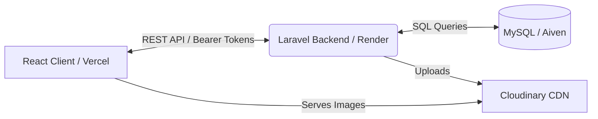

# Collos Hardware

[](https://react.dev)
[](https://laravel.com)
[](https://tailwindcss.com)
[](https://github.com/features/actions)

Collos Hardware is a premium, full-stack B2B and B2C E-commerce platform designed for commercial and industrial electrical components in East Africa. It features a decoupled architecture with a robust Laravel REST API and a highly reactive React Single Page Application (SPA).

---

## 🏗️ System Architecture

The application strictly separates the client and server domains:



### 1. Frontend (React 19 + Vite)
* **Framework:** React 19 powered by Vite for instant Hot Module Replacement (HMR) and optimized builds.
* **Routing:** `react-router-dom` utilizing nested layouts to guard Admin and Customer boundaries.
* **State Management:**
  * **Server State:** `@tanstack/react-query` handles caching and background syncs.
  * **Global State:** Redux Toolkit handles persistent app state (Shopping Cart).
* **UI/UX:** Tailwind CSS combined with Framer Motion for premium micro-animations. Forms are robustly handled by `react-hook-form` and validated strictly via `zod`.
* **Authentication:** Stateless token persistence in `localStorage`, injected into an Axios instance via request interceptors.

### 2. Backend (Laravel 11)
* **Architecture:** Modular API design (Auth, Catalog, Users, Settings, Payments).
* **Security:** 
  * **Sanctum:** Issues stateful Bearer Tokens for mobile-first API authentication.
  * **Spatie Permissions:** Enforces strict Role-Based Access Control (RBAC) via middleware. Super Admins possess elevated destructive capabilities.
  * **Rate Limiting:** Strict throttling middleware protecting critical authentication endpoints against brute-force attacks.
* **Integrations:**
  * **Google Socialite:** OAuth 2.0 flow for instant Registration/Login.
  * **Cloudinary:** Direct API integration for storing dynamic CMS content and avatars.
  * **M-Pesa:** Safaricom STK Push integration for automated regional payments.
  * **Sentry:** Real-time production error monitoring and stack-trace capturing.
* **Database:** Relational MySQL schema managing foreign constraints between users, roles, products, and categories.

---

## 🚀 Key Features

* **Dynamic CMS System:** Super Admins can dynamically alter the background images of the Home and About pages directly from the dashboard using Cloudinary uploads.
* **Multi-Tiered RBAC:** Distinct dashboards for Customers, standard Admins, and Super Admins.
* **Persistent Avatar Profiles:** Interactive profile drop-downs integrated into both the public-facing application and the internal admin layout.
* **Product Catalog:** Robust inventory system with category management, pricing, and stock status tracking.
* **Dark Mode Native:** Global theme context allows users to toggle between meticulously designed light and dark palettes.
* **Automated Payments:** M-Pesa STK push workflow with callback listeners.

---

## 🛠️ Local Development Setup

### Prerequisites
* Node.js (v20+)
* PHP (v8.3+)
* Composer
* MySQL Server

### 1. Backend Setup (Laravel)
```bash
cd backend
composer install
cp .env.example .env
php artisan key:generate
```
**Configure your `.env`:**
Update the database credentials and ensure Cloudinary/M-Pesa credentials are set.
```bash
php artisan migrate --seed
php artisan serve
```

### 2. Frontend Setup (React)
```bash
cd frontend
npm install
```
**Configure your `.env`:**
```env
VITE_API_URL=http://localhost:8000/api
```
```bash
npm run dev
```

---

## 📜 Deployment Infrastructure & CI/CD

* **Frontend:** Deployed automatically to **Vercel** utilizing their Edge Network for lightning-fast asset delivery.
* **Backend:** Hosted on **Render** utilizing Docker containers for PHP-FPM.
* **Database:** Managed MySQL instance hosted on **Aiven Cloud**.
* **Assets:** Served globally via **Cloudinary CDN**.
* **CI/CD Pipeline:** GitHub Actions automatically verify React builds (with Vite code splitting) and execute Laravel PHPUnit feature tests upon PR/Push to `main`.
